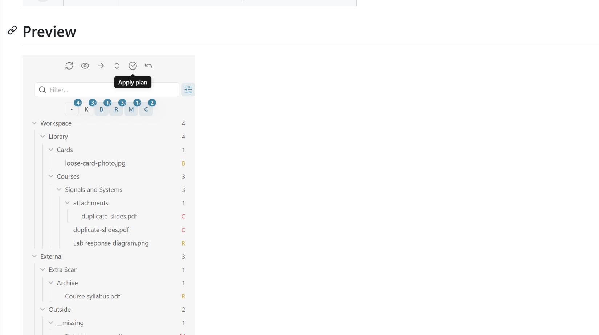

# Attachment Organize

Plan, preview, and safely organize Obsidian attachments around the notes that use them.

Attachment Organizer scans configurable areas of your vault, explains what should happen to each file, and waits for your approval before moving anything. It is built for vaults that mix notes, PDFs, images, drawings, and imported files across several folders.

## Preview



The Organizer gives every item a compact status:

| Mark | Status | Meaning |
|:----:|--------|---------|
| `-` | Note | A Markdown note, shown for context |
| `K` | Keep | Already in the right place or intentionally unchanged |
| `B` | To staging | Unreferenced attachment planned for the Staging folder |
| `R` | Relocate | Attachment planned for a location near its referencing note |
| `M` | Missing | Referenced by a note, but no matching file was found |
| `C` | Conflict | A duplicate name or occupied target makes the move unsafe |

Use the six filter buttons to focus the tree. Your selection is remembered when the Organizer is closed, reopened, or Obsidian is reloaded.

## Why use it?

- **Understand before changing** — Review Workspace, Staging, Extra Scan, and Outside files in one tree.
- **Preview the complete plan** — See source files, proposed targets, and action paths before applying anything.
- **Keep risky cases still** — Missing files and conflicts are reported instead of guessed or overwritten.
- **Organize around notes** — Place attachments beside a note, in a note subfolder, in a specified folder, or at the vault root.
- **Handle real vaults** — Detect regular links, embeds, frontmatter links, Excalidraw files, and Canvas files.
- **Recover from mistakes** — Undo the most recent batch operation.
- **Search without drawing noise** — Optionally seed global Search with `-file:.excalidraw.md` whenever Search receives focus.

## Typical workflow

1. Define a **Workspace** folder and a **Staging** folder in the plugin settings.
2. Optionally add one or more **Extra Scan** folders for files stored elsewhere.
3. Run **Attachment Organizer: Open organizer** from the command palette.
4. Filter the tree, enable Preview, and inspect any `B`, `R`, `M`, or `C` items.
5. Choose **Apply plan** only when the proposed moves look correct.
6. Use **Undo last operation** if the last batch needs to be reverted.

Nothing is moved during scanning or preview. Applying a plan requires confirmation, and conflict entries stay in place.

## Organizer controls

From left to right, the toolbar provides:

| Control | Action |
|---------|--------|
| Refresh | Rescan the configured folders |
| Preview | Show planned destination entries and strike through planned sources |
| Action paths | Display the destination path beside files planned for movement |
| Collapse/expand | Collapse or expand the complete tree |
| Apply plan | Confirm and execute conflict-free moves |
| Undo | Revert the most recently applied batch |

The filter panel supports Notes, Keep, To staging, Relocate, Missing, and Conflict as independent toggles. The optional statistics row updates immediately when its setting changes.

## Configuration

### Scan zones

| Setting | Description |
|---------|-------------|
| **Workspace folder** | Main area whose notes and attachments you want to organize; empty means the vault root |
| **Staging folder** | Destination for unreferenced Workspace attachments |
| **Enable Extra Scan** | Advanced, opt-in inventory of explicit folders outside Workspace and Staging |
| **Extra Scan folders** | One or more additional folders to inventory |
| **Recursive scan** | Include nested folders within every configured zone |

Files outside the configured zones can still appear under **Outside** when a note references them, when they are missing, or when they participate in the plan.
Extra Scan is deliberately conservative: keep it disabled unless a specific outside folder is required. Enabling it without adding a folder does not scan the whole vault; this keeps large vaults and development trees responsive.

### Links and placement

| Setting | Description |
|---------|-------------|
| **Backlink scope** | Choose which notes may add referenced files to the relationship graph; Whole vault can discover Outside targets |
| **Link sources** | Read regular links, embeds, and/or frontmatter links |
| **Placement mode** | Use the vault root, a specified folder, the note folder, or a subfolder under the note |
| **Multi-backlink policy** | Keep shared files unchanged, use the common ancestor, or follow the first reference |
| **Plan external attachments** | Include referenced Outside files in relocation planning |

Explicit paths in note links take priority over the general placement policy.

### Safety and detection

| Setting | Description |
|---------|-------------|
| **Global name check** | Detect duplicate basenames before planning a move; explicit paths can optionally bypass the check |
| **Attachment rules** | One regular expression per line for Markdown-based attachment formats |
| **Show stats** | Display live Notes, Attachments, Todo, Missing, Conflict, and Total counts |
| **Exclude Excalidraw files from global search** | Add `-file:.excalidraw.md` once when global Search receives focus |

The built-in attachment rules recognize `.excalidraw.md` and `.canvas.md`. The Search exclusion remains editable: remove it for the current search, and it will be seeded again the next time Search is opened or refocused.

## Installation

### Community plugins

When Attachment Organizer is available in Obsidian's community plugin catalog:

1. Open **Settings → Community plugins → Browse**.
2. Search for **Attachment Organizer**.
3. Install and enable the plugin.

### GitHub release

1. Download `main.js`, `manifest.json`, and `styles.css` from the [latest release](https://github.com/Kiteruunner/obsidian-attachment-organizer/releases/latest).
2. Create `<your-vault>/.obsidian/plugins/attachment-organizer/`.
3. Copy the three files into that folder.
4. Reload Obsidian and enable **Attachment Organizer** under Community plugins.

### Build from source

```bash
git clone https://github.com/Kiteruunner/obsidian-attachment-organizer.git
cd obsidian-attachment-organize
npm install
npm run build
```

Copy `main.js`, `manifest.json`, and `styles.css` into the plugin folder in your vault.

## Commands

- **Attachment Organizer: Open organizer**
- **Attachment Organizer: Rescan attachments**
- **Attachment Organizer: Apply organizer plan**
- **Attachment Organizer: Undo last organizer operation**

## Development

```bash
npm install
npm run lint
npm run build
```

The release workflow builds the plugin and publishes the three Obsidian release assets from a version tag.

## License

[MIT](LICENSE) © [Kirun](https://github.com/Kiteruunner)
